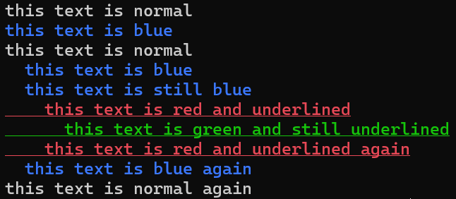

# Iro
Iro is a header-only C++14 library for printing text with color and other terminal effects  
Its defining feature is that it uses [RAII](https://en.wikipedia.org/wiki/Resource_acquisition_is_initialization) to automatically reset terminal effects, 
so unlike other fancy printing libraries, you don't have to remember to call some `reset()` function in order to return the terminal to its normal state

## Example
This code is copy-pasted from [basic_example.cpp](./basic_example.cpp):
```cpp
#include <iostream>

#define IRO_IMPL
#include "iro.h"

int main() {
std::cout << "this text is normal\n";
std::cout << iro::bright_blue << "this text is blue\n"; // automatically resets here
std::cout << "this text is normal\n";

    {
        // the blue effect will be automatically reset when tsg is destroyed
        iro::terminal_state_guard tsg = std::cout << iro::bright_blue << "  this text is blue\n";
        std::cout << "  this text is still blue\n";

        {
            iro::terminal_state_guard tsg1 = std::cout << iro::bright_red << iro::underline;
            std::cout << "    this text is red and underlined\n";

            {
                iro::terminal_state_guard tsg2 = std::cout << iro::bright_green;
                std::cout << "      this text is green and still underlined\n";
            } // tsg2 destroyed
            std::cout << "    this text is red and underlined again\n";
        } // tsg1 destroyed
        std::cout << "  this text is blue again\n";

    } // tsg destroyed
    std::cout << "this text is normal again\n";
}
```
And this is what that code outputs (using windows terminal):  


## Build
It's a header-only library, so just put `#define IRO_IMPL` before `#include "iro.h"` in *one* .cpp file, and then include iro.h normally everywhere else
```cpp
#define IRO_IMPL // only do this in ONE .cpp file! And it has to be BEFORE #include "iro.h"
#include "iro.h"

int main() {
    // go crazy...
}
```

To clone the libary and build the example:
```shell
git clone https://github.com/original-picture/iro
cd iro
cmake -B build -S .
cd build
cmake --build .
```

## Features
* supported effect types
  * foreground_color (16 colors)
  * background_color (16 colors)
  * font_weight 
    * bold
    * faint
    * normal
  * underlinedness
  * blink
* RAII management of terminal effects
* `effect_string` class for embedding effects in strings

## Documentation
TODO! (I'm working on it!)
In the meantime, check out [more_complex_example.cpp](./more_complex_example.cpp). It has lots of comments explaining what's going on

## TODO
- [ ] proper documentation
- [ ] 256 color support
- [ ] clean up the platform specific code
- [ ] hoisting up effects that are buried in the stack